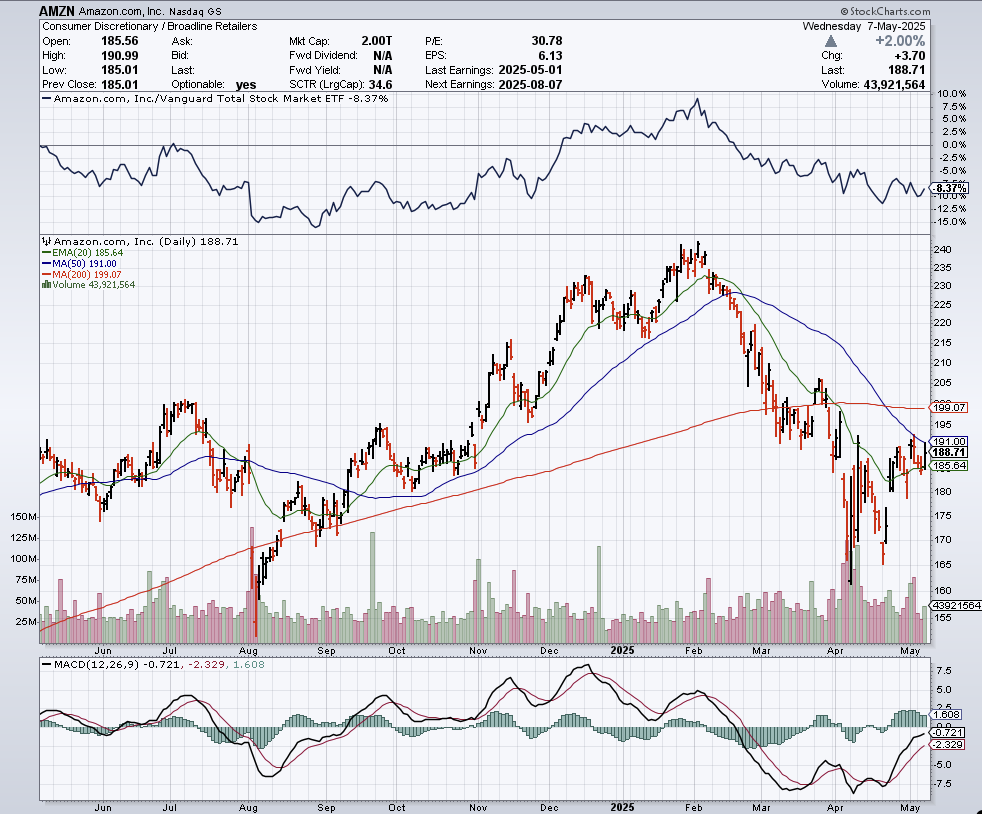
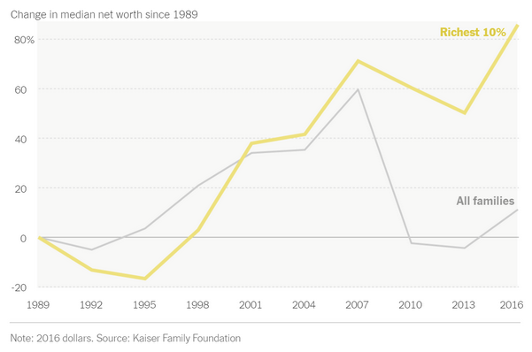
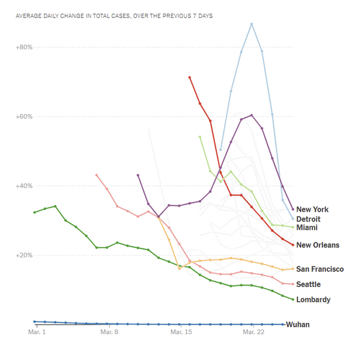

```{r setup, include=FALSE}
knitr::opts_chunk$set(echo = TRUE)
```

# Decomposing a time series

## Summary of the manipulation

-   Separate time series into 3 components:

    -   Trend

    -   Seasonality

    -   Noise

## Types of patterns this manipulation makes easier for a viewer

-   Good for anything that have a circular/seasonal pattern

    -   Removing seasonality can show long-term trends

-   Reducing noise reduces random anomalies that can't be accounted for that can skew results

-   Breaking into components separately helps paint the whole picture and easier for viewers to digest what you're trying to show

## Example of graphic from beyond the book



[Source](https://stockcharts.com/sc3/ui/?s=AMZN)

\newpage
# Using a single index

## Summary of the manipulation

-   Use a single index origin as a reference point and graph % change relative to that point rather than absolute change

## Types of patterns this manipulation makes easier for a viewer

-   Direct comparison to reference point

-   Shows relative change vs absolute change which is easier to compare and demonstrate your point

## Example of graphic from beyond the book



[Source](https://www.nytimes.com/2021/05/11/learning/lesson-plans/teach-about-inequality-with-these-28-new-york-times-graphs.html)

\newpage

# Using a rate of change

## Summary of the manipulation

-   Calculates ratio between consecutive time periods

    -   For exponential growth or large ranges, log values can be used

## Types of patterns this manipulation makes easier for a viewer

-   Can highlight potential warning signs that aren't readily apparent from raw data

## Example of graphic from beyond the book



[Source](https://www.nytimes.com/2020/04/02/learning/7-ways-to-explore-the-math-of-the-coronavirus-using-the-new-york-times.html)
